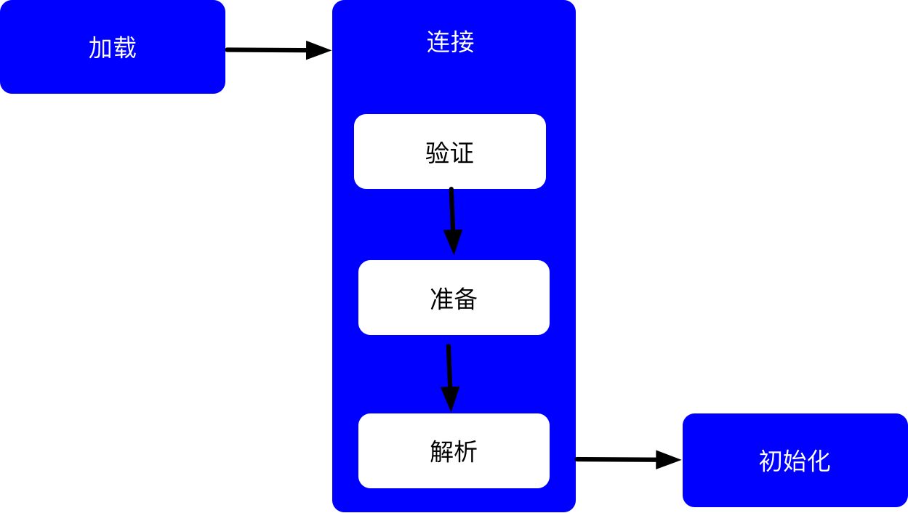
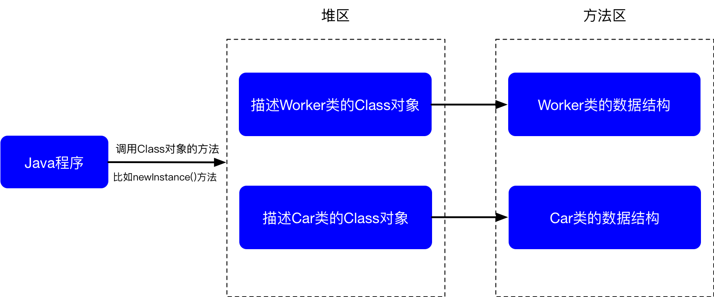

## ClassLoader
* 在如下的几种情况下，Java虚拟机将结束生命周期
    * 执行了 `System.exit()`方法
    * 程序正常执行结束
    * 程序在执行过程中遇到了异常或错误而异常终止
    * 由于操作系统出现错误而导致Java虚拟机

#### 类的加载、连接 初始化
* 加载：查找斌加载类的二进制数据
* 连接
    * 验证：确保被加载的类的正确性 
    * 准备：为类的**静态变量**分配内存，并将其初始化为**默认值**
    * 解析：把类的符号引用转换为直接引用
* 初始化：为类的**静态变量**赋予**正确的初始值**

    
    
* Java程序对类的使用方式可分为两种
    * 主动使用
    * 被动使用
* 所有的Java虚拟机实现必须在每个类或接口被Java程序“**首次主动使用**”时才**初始化**他们
* 主动使用（六种）
    * 创建类的实例
    * 访问某个类或接口的静态变量，或者对该静态变量赋值
    * 调用类的静态方法
    * 反射（如：`Class.forName("com.lsl.test.Test")`）
    * 初始化一个类的子类
    * Java虚拟机启动时被标明为**启动类**的类
* 除了以上六种情况以外，其他的全都是被动调用
* 类的加载是指将类的.class文件中的二进制数据读入到内存中，将其放在运行时数据区的方法区内，然后在堆区创建一个`java.lang.Class`对象，用来封装类在方法区内的数据结构，可以看出Class对象是由Java虚拟机创建的
* 加载.Class文件的方式
    * 从本地系统中直接加载
    * 通过网络下载.Class文件
    * 从zip，jar等归档文件中加载.Class文件
    * 从专有数据库中提取.Class文件
    * 将Jav源文件动态编译为.Class文件

    
    
* 类的加载的最终产品是位于堆中的Class对象
* Class对象封装了类在方法区内的数据结构，并且向Java程序员提供了访问方法区内的数据结构的接口（反射接口）
* 有两种类型的类加载器
    * Java虚拟机自带的加载器
        * 根类加载器
            * BootStrap:使用C++编写，无法在Java代码中获得该类
            * 由根类加载器加载的类，获取到它的类加载器会返回null
            * 如获取String类的类加载器返回的就会为null,说明String类由根类加载器加载
            
                ```java
                Class clazz = Class.forName("java.lang.String");
                System.out.println(clazz.getClassLoader());
                ======>null
                ```
                
            * 然后我们在自己写一个了类‘C’，再去获取它的类加载器

                ```java
                Class clazz = Class.forName("com.lsl.test.C");
                System.out.println(clazz.getClassLoader());
                ======>sun.misc.Launcher$AppClassLoader@2a139a55
                ```
                * 可以看出类C是是由系统加载器加载的
            * 
        * 扩展类加载器
            * Extension:使用Java代码实现
        * 系统加载器（应用加载器）
            * System:使用Java代码实现
    * 用户自定义的类加载器
        * java.lang.ClassLoaser的子类
        * 用户可以定制类的加载方式
* 类加载器**并不需要**某个类 "首次主动使用"时再加载它
* JVM规范允许类加载器在预料某个类将要被使用时就预先加载它，如果在预先加载的过程中遇到了.class文件缺失或存在错误，类加载器必须在程序首次主动使用该类时才报告错误（**LinkageError错误**）
* 如果这个类一直没有被程序主动使用，那么**类加载器就不会报告错误**
* 类被加载后，就进入连接阶段。连接就是将已经读入到内存的类的二进制数据合并到虚拟机运行时环境中去。
* **类的验证**
    * 类文件的结构检查
        * 确保类文件遵从Java类文件的固定格式
    * 语义检查
        * 确保类本身符合Java语言的语法规定，比如验证final类型的类没有子类，以及final类型的方法没有被覆盖
    * 字节码验证
        * 确保字节码流可以被Java虚拟机安全的执行
    * 二进制兼容性的验证
        * 确保相互引用的类之间协调一致
* **类的准备**
    * 在准备阶段，Java虚拟机为类的静态变量分配内存，并设置**默认初始值**。例如对于以下Sample类，在准备阶段，将为int类型的静态变量a分配4个字节的内存空间，并且赋予默认值0，为long类型的静态变量b分配8个字节的内存空间，并且赋予默认值0
    
        ```java
        public class Sample{
            private static int a = 1;
            public static long b;
            
            static {
                b = 2;
            }
        }
        ```

* **类的解析**
    * 在解析阶段，Java虚拟机会把类的二进制数据中的符号引用替换为直接引用。例如在Worker类的gotoWork()方法中会引用Car类的run()方法

        ```java
        public void gotoWork(){
            car.run();//这段代码在Worker类的二进制数据中表示为符号引用
        }
        ```
    
    * 在Worker类的二进制数据中，包含了一个对Car类的run()方法的符号引用，它由run()方法的全名和相关描述符组成，在解析阶段，Java虚拟机会把这个符号引用替换为一个指针，该指针指向Car类的run()方法在方法区内的内存位置，这个指针就是直接引用
*  **类的初始化**
    *  在初始化阶段，Java虚拟机执行类的初始化语句，为类的静态变量赋予**初始值**。在程序中，静态变量的初始化有两种途径:
        *  在静态变量的声明处进行初始化
        *  在静态代码块中进行初始化
