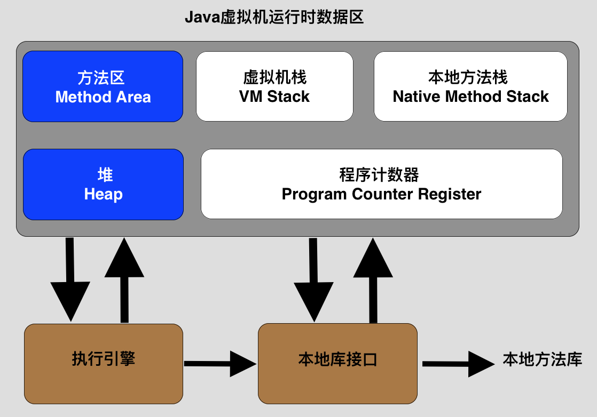

### JVM
* JVM运行时的数据区域

    
<<<<<<< HEAD
    
* 程序计数器
    * 程序计数器是一块较小的内存空间，它可以看作是当前线程所执行的字节码的行号指示器,每条线程都有一个独立的程序计数器，各条线程之间计数器互不影响，独立存储，这类内存区域为“线程私有”的内存。
    * 如果线程正在执行的是一个Java方法，这个计数器记录的是正在执行的虚拟机字节码指令的地址；如果正在执行的是Native方法，这个计数器值则为空（Undefined）。**此内存区域是唯一一个在Java虚拟机规范中没有规定任何OutOfMemoryError情况的区域**。
* 
=======

* **方法区**
<<<<<<< HEAD
=======

>>>>>>> f01251ea937dc9e3a9eed5764140b090698658df
>>>>>>> 404d0621673d67462733e934ab4df43ef92260d2
