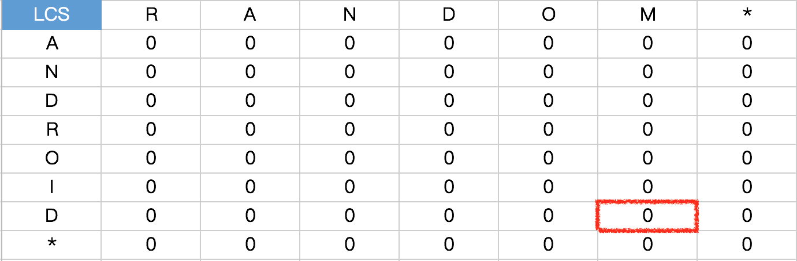
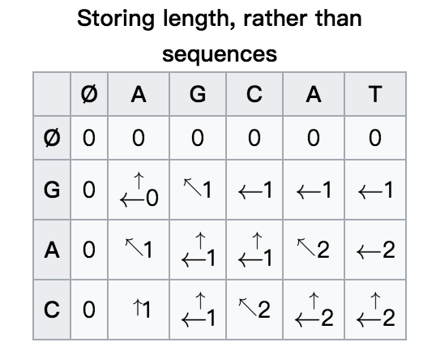
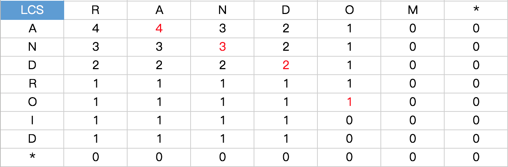

### LCS(Longest Common Subsequence)
#### 定义
+ LCS即最长公共子序列（**不要求连续**），就是当要找出两个字符串中的最长公共子序列时就会用到LCS算法，也称动态规划算法
+ 例如：`String a = "android" String b = "random"`
    + 当我们看到这两个字符串的时候，很容易看出a和b的最长公共子序列即`ando`可是我们怎么用程序给它表现出来呢
    + 首先看看下面的公式，其中**dp**为二维数组，**i**表示行，**j**表示列，**A**表示主串，**B**表示模式串
    
        ```java
        //方式一：从前往后  i和j=0
                  0 (如果i=0且j=0)   ①
        dp[i][j]= dp[i-1][j-1] + 1 (如果i和j>0,且A[i]=B[j])  ②
                  max(dp[i][j-1],dp[i-1][j]) (如果i和j>0，且A[i]!=B[j])  ③
                  
        //方式二：从后往前 i和j分别等于行和列的长度
                  0 (如果i=0且j=0)  ①
        dp[i][j]= dp[i+1][j+1] + 1 (如果i和j>0,且A[i]=B[j])  ②
                  max(dp[i][j+1],dp[i+1][j]) (如果i和j>0，且A[i]!=B[j])  ③
        ```
        先来初始化一个二位数组,在最后加了一行一列是为了下面查找公共子串如下:
        
        然后我们在根据上面的公式**从后往前（方式二）**填空，即从`dp[6][5]`(第6行第5列开始)，如下:
        
        填空之前先看看这张图吧（这张图的顺序是从前往后的）
        
        下面是填写好的`android`和`random`的二维数组图（从后往前）
        
+ 接下来看看怎么用代码先把这个二维数组`dp[][]`构造出来，看看需要什么
    + 两个字符串
    + 一个二位数组
    + 接着就是套用上面的公式（方式二）

        ```java
         /**
         * 生成二维数组
         * @param str1 主串
         * @param str2 模式串
         * @return
         */
        public void generateLCS(char[] str1,char[] str2){
            int m = str1.length;
            int n = str2.length;
            //声明一个二维数组
            int[][] dp = new int[m+1][n+1];
            //从后往前
            for(int i = m-1; i>=0; i--){
                for(int j = n-1; j>=0; j--){
                    //方式二公式里面的 ②
                    if(str1[i] == str2[j]){
                        dp[i][j] = dp[i+1][j+1] + 1;
                    }else{
                        //方式二公式中的 ③
                        dp[i][j] = Math.max(dp[i][j+1],dp[i+1][j]);
                    }
                }
            }
            //dp[][] 构造完毕，接着打印看看
            //调用:generateLCS("android".toCharArray(),"random".toCharArray());
        }
        //输出:
        4	4	3	2	1	0	0	
        3	3	3	2	1	0	0	
        2	2	2	2	1	0	0	
        2	1	1	1	1	0	0	
        1	1	1	1	1	0	0	
        1	1	1	1	0	0	0	
        1	1	1	1	0	0	0	
        0	0	0	0	0	0	0	
        //是不是和上面第二个表是一样的呢。。。
        ```
        
        + 从上面的输出可以看到`android`和`random`的最大公共子序列的的长度为**4**
        但是我们怎么把这4个字符找出来了呢 
        + 这里我们**从前往后查找** 
            + 当`str1[i]==str2[j]`的时候说明这个字符为公共子序列中的一个字符，此时我们把`str[i]`输出，然后`i++,j++`就是把行和列各加1
            + 当当前元素**下面的值大于或等于右边的值**的时候，我们让`i+1`即向下挪一行，则有`if(dp[i+1][j] >= dp[i][j+1]){ i++; }`
            + 当当前元素**下面的值小于右边的值**的时候，我们让`j+1`即向右挪一列，则有`if(dp[i+1][j] < dp[i][j+1]){ j++; }`
            + 代码如下:
            
                ```java
                System.out.println("LCS:");
                //找出最大公共子序列字符
                int i = 0; int j = 0;
                while(i < str1.length && j < str2.length){
                    if(str1[i] == str2[j]){
                        System.out.printf(str1[i] + "\t");
                        i++;
                        j++;
                    }else if(dp[i+1][j] >= dp[i][j+1]){
                        i++;
                    }else{
                        j++;
                    }
                }
                //输出：
                LCS:
                a	n	d	o
                ```
+ 下面是完整代码

    ```java
        /**
         * Created by liusilong on 2017/6/11.
         */
        public class LCS5 {
            @Test
            public void main() {
                char[] str1 = "android".toCharArray();
                char[] str2 = "random".toCharArray();
                createLCS(str1, str2);
            }
        
            public void createLCS(char[] str1, char[] str2) {
                int m = str1.length;
                int n = str2.length;
                int[][] opt = new int[m + 1][n + 1];
        //        构建二维数组 从后往前
                for (int i = m - 1; i >= 0; i--) {
                    for (int j = n - 1; j >= 0; j--) {
                        if (str1[i] == str2[j]) {
                            opt[i][j] = opt[i + 1][j + 1] + 1;
                        } else {
                            opt[i][j] = Math.max(opt[i][j + 1], opt[i + 1][j]);
                        }
                    }
                }
        
        //        输出二维数组
                for (int i = 0; i < opt.length; i++) {
                    for (int j = 0; j < opt[i].length; j++) {
                        System.out.printf(opt[i][j] + "\t");
                    }
                    System.out.println();
                }
                System.out.println("LCS:");
        //       找出LCS 从前往后
                int i = 0;
                int j = 0;
                while (i < str1.length && j < str2.length) {
                    if (str1[i] == str2[j]) {
                        System.out.printf(str1[i] + "\t");
                        i++;
                        j++;
                    } else if (opt[i + 1][j] >= opt[i][j + 1]) {//如果 Bottom >= right
                        i++;
                    } else {
                        j++;
                    }
                }
        
        }
    }
    ```
    
        