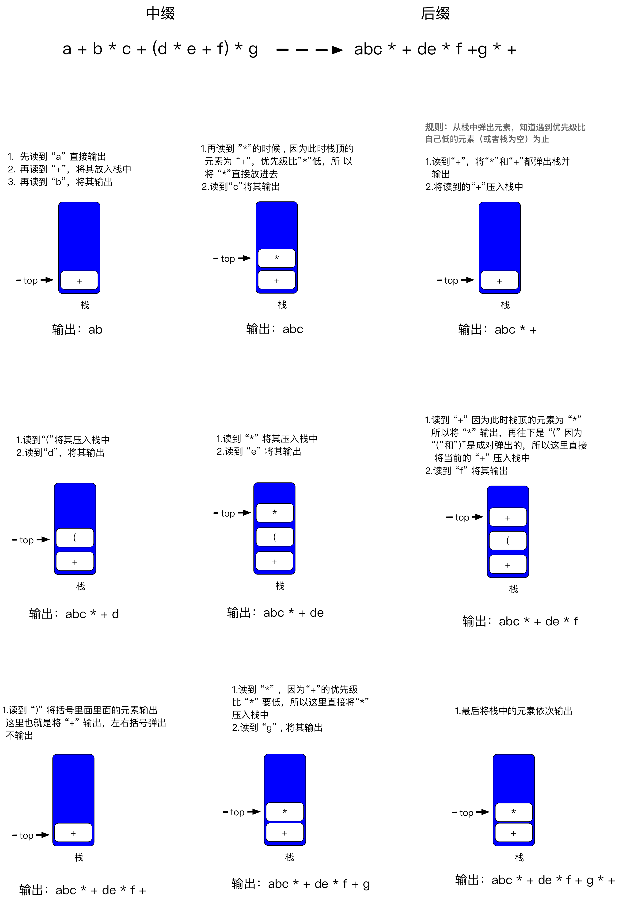
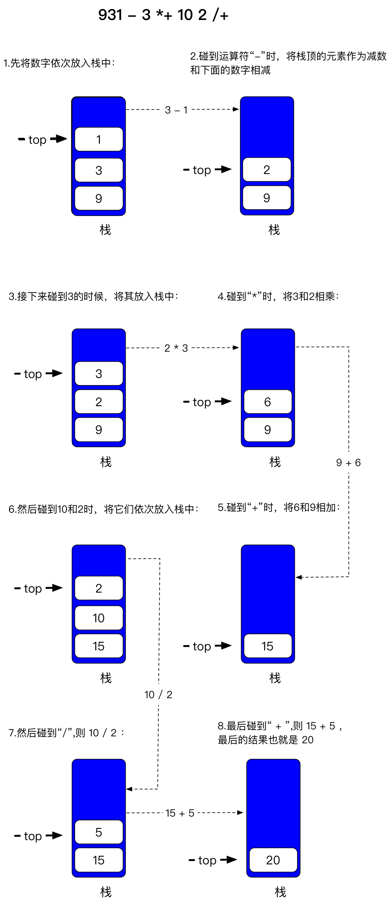

### 栈的应用
* 后缀表达式（波兰表达式）
    * 我们平时看到的“1+1”这样的表达式称为**中缀表达式**，但这样的表达式在计算机中是将其转换为**后缀表达式**来进行运算的
    
    * 例如中缀表达式“a + b * c + (d * e + f) * g”转成后缀表达式就是“abc * + de * f + g * +”,这是怎么转换的呢？转成这样计算机又是如何进行运算的呢？我们先来看看转换步骤：
        * 如果遇到**操作数**，就直接将其**输出**
        * 如果遇到**操作符**，则将其**放入到栈中**，遇到**左括号**也将其**放入栈中**
        * 如果遇到一个右括号（即栈中有成对的括号），则将栈元素弹出，将弹出的操作符输出，知道遇到左括号位置，注意，左右括号只弹出，不输出
        * 如果遇到其他的任何操作符，如：“+”，“x(乘号)”等，则从栈中弹出元素**直到遇到优先级比自己低的元素（或者栈为空）为止**，**弹出这些操作符后，才将遇到的操作符压入栈中**
        * 只有在遇到“ ）”的情况下我们才弹出 “（ ”，其他情况都不会弹出“（ ”
        * 如果我们读到了输入的末尾，则将栈中所有元素一次弹出并输出

    * 实例如下

        
        
    * 接着再来看看计算机是怎么运算后缀表达式的，例如**中缀表达式：**“9+(3-1)* 3 + 10 /2” 利用上述规则转换为**后缀表达式：** “931  - 3 *+ 10 2 /+”，在计算机中的运算如下

        
        
    * [参考链接](http://blog.csdn.net/sgbfblog/article/details/8001651)